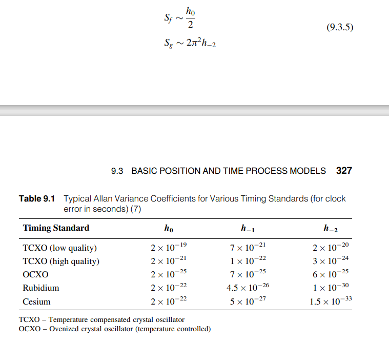

# EKF Formulation for GNSS PPP

This document summarizes the Extended Kalman Filter (EKF) implementation for Precise Point Positioning (PPP) using GNSS measurements, particularly Pseudorange (PR) and Range Rate observations. It discusses the predict and update steps for different state models and measurement types.

---

## State Vector

The state vector includes:

```
x = [
  p_x, p_y, p_z,         # receiver position (m)
  v_x, v_y, v_z,         # receiver velocity (m/s)
  c_dt,                  # receiver clock bias (m)
  c_dt_dot               # receiver clock drift (m/s)
]
```

---

## EKF with PV Model (using only PR measurements)

### Predict Step

```
x_k = F * x_{k-1}

p(t+dt) = p(t) + v(t)·dt
v(t+dt) = v(t) + w(t)

F = [
  [I, Δt·I,  0,     0 ],
  [0,  I,    0,     0 ],
  [0,  0,    1,  Δt   ],
  [0,  0,    0,   1   ]
]
```

The full process noise matrix `Q_k` has the following block-diagonal structure

```
Q_k = [
  Q_pv,        0
    0,     Q_clock
]

```

Then the velocity evolves with a random walk process noise, and the standard integrated RW covariance is:

```
Q_pv = σ² * [
  [Δt³/3 · I,  Δt²/2 · I],
  [Δt²/2 · I,     Δt · I]
]
```
Here, σ² is the power spectral density (PSD) of the velocity noise. The units of σ²: [m²/s³] (since v is in m/s)

For the clock part, see the last section.

### Update Step

Measurement model (pseudorange):

```
PR = ||x - x_sat|| + c*(dt - dt_sat)
```

Design matrix H (w.r.t. state x):

```
H = [los_vector, 0_3, 1, 0]
```

---

## EKF with PV Model (using PR + Range Rate)

### Predict Step

Same as above.

### Update Step

Pseudorange measurement model (same as above).

Range rate measurement model:

```
RR = (v_sat - v_rec) • los + c*(dt_dot - dt_dot_sat - rel_clock_rate_sat)
```

Design matrix H for range rate:

```
H = [0_3, -los_vector, 0, 1]
```

---

## EKF with Random Walk Model (using PR + Range Rate)

### Predict Step

Assuming all states are random walks:

```
x_k = x_{k-1}
F = I
```

and respectively, the covariance follow the typical random walk diagonal matrix.

### Update Step

Same pseudorange and range rate models as above.

H matrix (same):

```
PR:        H = [los_vector, 0_3, 1, 0]
RangeRate: H = [0_3, -los_vector, 0, 1]
```

---

## Clock Model Discussion

Clock states typically follow a linear dynamic model due to oscillator behavior:

```
x = [
  c_dt,                  # receiver clock bias (m)
  c_dt_dot               # receiver clock drift (m/s)
]
```

The clock model prediction is the following (assuming random walk for both clock bias and clock drift):

```
c_dt_k     = c_dt_{k-1}     + dt * c_dt_dot_{k-1} + w_bias
c_dt_dot_k = c_dt_dot_{k-1}                       + w_drift
```

or in matrix form

```
[c_dt    ]        = [1  Δt] * [c_dt    ]
[c_dt_dot]_(k+1)    [0  1 ]   [c_dt_dot]_(k)

```

### Covariance Model

The process noise covariance matrix `Q` models the stochastic behavior of clock bias and drift. It accounts for two types of noise:

    S_f: Power Spectral Density (PSD) of the clock bias noise (units: m²/s)

    S_g: PSD of the clock drift noise (units: m²/s³)

Using these, the discrete-time covariance matrix for the state becomes:
```
Q_clock = [
    [ S_f·Δt + S_g·Δt^3/3 ,   S_g·Δt^2/2 ],
    [ S_g·Δt^2/2          ,   S_g·Δt     ]
]
```

Values of S_f and S_g (from Allan Variance parameters):




This naturally leads to correlated evolution between clock bias and drift.

- The process noise for `c_dt_dot` often drives the uncertainty in `c_dt`.
- This model aligns with the PV model's dynamics.

### Key Observations

* The clock bias uncertainty grows due to both its own noise (`S_f`) and the integration of clock drift noise (`S_g`).

* The clock bias and drift are modeled as random walks.

* The off-diagonal terms reflect that clock bias and drift are statistically correlated due to the integration of drift into bias.

* This model aligns conceptually with the position-velocity (PV) model often used in Kalman filters.

For the clock modelling see the reference:

    Brown & Hwang – Introduction to Random Signals and Applied Kalman Filtering, Chapter 11 (GNSS clock modeling).

---

## Summary

- Use PV model if you want physical consistency between position and velocity.
- Use random walk model for loosely coupled states or in simpler implementations.
- Range Rate is a valid alternative to Doppler (nearly equivalent), but make sure the measurement model reflects your actual observable.
- Clock bias and drift should be correlated in most realistic filters.
